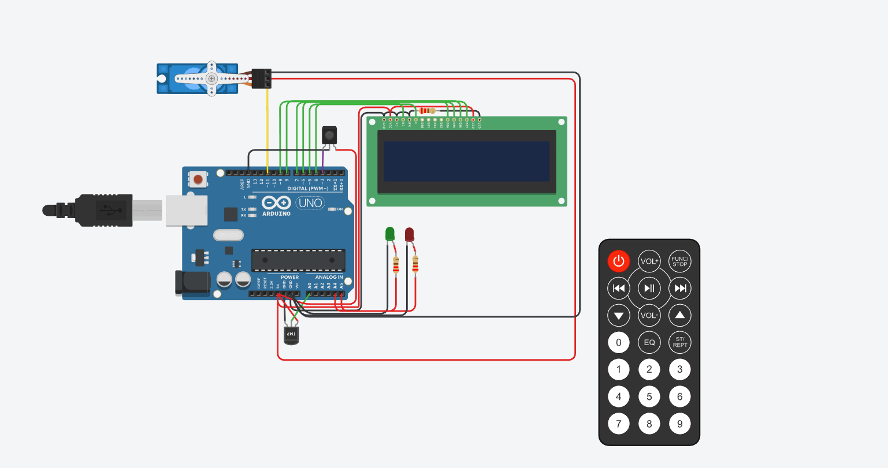

<!-- ENCABEZADO TITULO -->
# Proyecto: Sistema de incendio.



## Integrante:
* Agustin Matias Garcia Navas

## Descripcion:

Es un sistema de incendio el cual muestra por pantalla lcd la temperatura actual y la estacion del año. En caso de ocurrir un incendio nos avisa mediante un led rojo y por la pantalla. Esta misma muestra un mensaje de aviso "INCENDIO" y la respectiva temperatura. En ese preciso momento se activa el servo para poder apagar el incendio, una vez apagado el incendio automaticamente se apaga el servo.

## Funcion 1

Esta funcion se encarga de mostrar por el display LCD un mensaje.
* Primer pametro: Ingresamos la posicion del caracter en una fila
* Segundo parametro: Ingresamos la posicion de la fila que se encontrara
* Tercer parametro: Ingresamos el mensaje que deseamos mostrar


<!--- ACA PUEDO ESCRIBIR BLOQUES DE CODIGO-->
```
void mostrarMensajeLcd(int posCaracter,int posFila, char* mensaje) // muestro por pantalla del lcd
{
  lcd.setCursor(posCaracter,posFila);
  lcd.print(mensaje);
}
```

## Funcion 2
Se encarga de mover el servo desde su posicion inicial 0 grados hasta su posicion final 180 grados y luego regresa a su posicion inicial, esto ocurre con un delay de 1500 milisegundos en cada movimiento.
* Dentro del servo1.write se le pasa por parametro los grados que se desea.

```
void moverServo()
{
  servo1.write(180);
  delay(1500);
  
  servo1.write(0);
  delay(1500);
}
```


## Funcion 3
Se encarga de utilizar el control remoto y sus respectivos botones mediante un sensor IR.
Esta funcion nos retorna la estacion del año segundo el boton que se haya presionado.
* Primer parametro: Se pasa una variable del tipo char para que nos devuelve el valor.
* Dentro del if se verifica si el sensor IR recibio una señal del control remoto.
* Luego se verifica si el boton presionado es el 1,2,3 o 4 ( se encuentran en numero HEX ) en caso de ser asi le asignamos un valor a la variable que se ingreso por parametro en la funcion y por IR.resume() restauro el sensor para poder recibir otra señal.
* Por ultimo retornamos dicho valor.


```
char* controlRemoto(char* boton) 
{	
  
  if(IR.decode()) 
  {	
  	//Serial.print(IR.decodedIRData.decodedRawData,HEX); 
    
    if(IR.decodedIRData.decodedRawData == 0xEF10BF00)   //boton 1 = EF10BF00
    { 
      boton = "Verano"; // VERANO
    }
    else if(IR.decodedIRData.decodedRawData == 0xEE11BF00)  //boton 2 = EE11BF00
    { 
      boton = "Otono"; // OTOñO
    }
    else if(IR.decodedIRData.decodedRawData == 0xED12BF00)  //boton 3 = ED12BF00
    { 
      boton = "Invierno"; // INVIERNO
    }
    else if(IR.decodedIRData.decodedRawData == 0xEB14BF00)  //boton 4 = EB14BF00
    { 
      boton = "Primavera"; //PRIMAVERA
    }
    
    delay(10);
    IR.resume();     
  }
  
  return boton;
}
```

## Funcion 4
Se encarga de encender un led verde si la temperatura de la estacion se encuentra dentro de los parametros normales y en caso de haber un incendio se enciende el led rojo.
* Primer parametro: Se pasa una variable del tipo booleano donde va contener el valor "false" si no hay un incendio y "true" si hay un incendio.
* Dentro del digitalWrite se pasan por parametro el pin donde se encuentra conectado el led y 1 (encender), 0 (apagar)
```
void prenderLeds(bool incendio)
{
  if(incendio == false)
  {
    digitalWrite(LED_VERDE,1);
    digitalWrite(LED_ROJO,0);
  }
  else if(incendio == true)
  {	
    digitalWrite(LED_VERDE,0);
    digitalWrite(LED_ROJO,1);
  }
  
}
```


<!-- ENLACE DIRECTO AL PROYECTO-->
## :clipboard: Link al proyecto

* [Mi proyecto](https://www.tinkercad.com/things/fmW1sei6T9f-tp-final/editel?sharecode=CpSwpL86V16bdi4K2PIToDubjAG0VT-5DTiESs7qGQw)