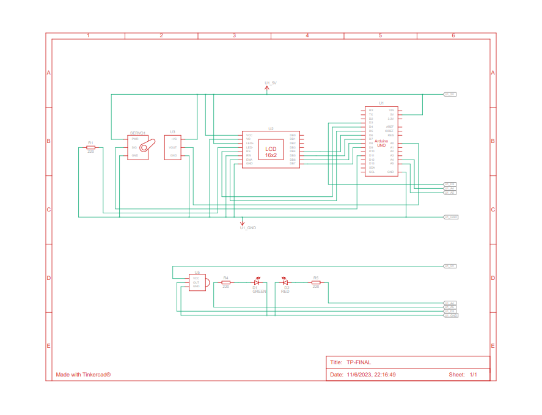

<!-- ENCABEZADO TITULO -->
# Proyecto: Sistema de incendio.


## Integrante:
* Agustin Matias Garcia Navas

## Descripcion:

Es un sistema de incendio el cual muestra por pantalla lcd la temperatura actual y la estacion del año. En caso de ocurrir un incendio nos avisa mediante un led rojo y por la pantalla. Esta misma muestra un mensaje de aviso "INCENDIO" y la respectiva temperatura. En ese preciso momento se activa el servo para poder apagar el incendio, una vez apagado el incendio automaticamente se apaga el servo.

## Componentes utilizados
* Arduino Uno
* 2 leds
* Servo
* Display Lcd
* Senson Temperatura
* Sensor IF
* Control Remoto IF
* 3 resistencias


## Diagrama Esquematico



## Codigo Principal

En este fragmento de codigo es donde se ejecuta la logica del programa, donde en primera instancia se inicaliza el servo en la posicion 0, luego recibimos los valores del sensor de temperatura y se realiza un map para indicar que el valor debe ir desde -40c hasta 125c. Se crea un mensaje en donde se concatena el valor de la variable temperatura con un mensaje del tipo string y por ultimo se realiza las respectivas validaciones para saber si ocurre un incendio o no, en caso que si ejecutaran ls respectivas funciones.

```c++
void loop()
{
  servo1.write(0); //para que vuelva a la posicion 0 ya que inicia a 90
	
  //obtengo la temperatura
  sensorTemp = analogRead(A0); //leo la temp
  int temperatura = map(sensorTemp,20,358,-40,125); //la transformo a ªc
  
  temporada = controlRemoto(temporada);
  
  sprintf(mensaje, "Temp: %3d", temperatura); // concateno una cadena y un entero en la
												   
  if(temporada == "Verano" && temperatura > 80)
  {
    incendio = true;

  }
  else if(temporada == "Otono" && temperatura > 60)
  {
    incendio = true;

  }
  else if(temporada == "Invierno" && temperatura > 40)
  {
    incendio = true;

  }
  else if(temporada == "Primavera" && temperatura > 50)
  {
    incendio = true;

  }
  else
  {
    incendio = false;
    
  }
  
  prenderLeds(incendio); //prende el led segun el estado del incendio(true o false)

  if(incendio == true)
  {
    mostrarMensajeLcd(0,0,"INCENDIO PELIGRO!    ");
    mostrarMensajeLcd(0,1,mensaje);
  	moverServo();
    
  }
  else
  {
    mostrarMensajeLcd(0,0,"Est: ");
    mostrarMensajeLcd(5,0,temporada);
    lcd.print("         ");
    mostrarMensajeLcd(0,1,mensaje);
    lcd.print("C"); 
  }
  Serial.println(temperatura);
  
}
```


## Funcion 1

Esta funcion se encarga de mostrar por el display LCD un mensaje.
* Primer pametro: Ingresamos la posicion del caracter en una fila
* Segundo parametro: Ingresamos la posicion de la fila que se encontrara
* Tercer parametro: Ingresamos el mensaje que deseamos mostrar


<!--- ACA PUEDO ESCRIBIR BLOQUES DE CODIGO-->
```c++
void mostrarMensajeLcd(int posCaracter,int posFila, char* mensaje) // muestro por pantalla del lcd
{
  lcd.setCursor(posCaracter,posFila);
  lcd.print(mensaje);
}
```

## Funcion 2
Se encarga de mover el servo desde su posicion inicial 0 grados hasta su posicion final 180 grados y luego regresa a su posicion inicial, esto ocurre con un delay de 1500 milisegundos en cada movimiento.
* Dentro del servo1.write se le pasa por parametro los grados que se desea.

```c++
void moverServo()
{
  servo1.write(180);
  delay(1500);
  
  servo1.write(0);
  delay(1500);
}
```


## Funcion 3
Se encarga de utilizar el control remoto y sus respectivos botones mediante un sensor IR.
Esta funcion nos retorna la estacion del año segundo el boton que se haya presionado.
* Primer parametro: Se pasa una variable del tipo char para que nos devuelve el valor.
* Dentro del if se verifica si el sensor IR recibio una señal del control remoto.
* Luego se verifica si el boton presionado es el 1,2,3 o 4 ( se encuentran en numero HEX ) en caso de ser asi le asignamos un valor a la variable que se ingreso por parametro en la funcion y por IR.resume() restauro el sensor para poder recibir otra señal.
* Por ultimo retornamos dicho valor.


```c++
char* controlRemoto(char* boton) 
{	
  
  if(IR.decode()) 
  {	
  	//Serial.print(IR.decodedIRData.decodedRawData,HEX); 
    
    if(IR.decodedIRData.decodedRawData == 0xEF10BF00)   //boton 1 = EF10BF00
    { 
      boton = "Verano"; // VERANO
    }
    else if(IR.decodedIRData.decodedRawData == 0xEE11BF00)  //boton 2 = EE11BF00
    { 
      boton = "Otono"; // OTOñO
    }
    else if(IR.decodedIRData.decodedRawData == 0xED12BF00)  //boton 3 = ED12BF00
    { 
      boton = "Invierno"; // INVIERNO
    }
    else if(IR.decodedIRData.decodedRawData == 0xEB14BF00)  //boton 4 = EB14BF00
    { 
      boton = "Primavera"; //PRIMAVERA
    }
    
    delay(10);
    IR.resume();     
  }
  
  return boton;
}
```

## Funcion 4
Se encarga de encender un led verde si la temperatura de la estacion se encuentra dentro de los parametros normales y en caso de haber un incendio se enciende el led rojo.
* Primer parametro: Se pasa una variable del tipo booleano donde va contener el valor "false" si no hay un incendio y "true" si hay un incendio.
* Dentro del digitalWrite se pasan por parametro el pin donde se encuentra conectado el led y 1 (encender), 0 (apagar)
```c++
void prenderLeds(bool incendio)
{
  if(incendio == false)
  {
    digitalWrite(LED_VERDE,1);
    digitalWrite(LED_ROJO,0);
  }
  else if(incendio == true)
  {	
    digitalWrite(LED_VERDE,0);
    digitalWrite(LED_ROJO,1);
  }
  
}
```


<!-- ENLACE DIRECTO AL PROYECTO-->
## :clipboard: Link al proyecto

* [Mi proyecto](https://www.tinkercad.com/things/fmW1sei6T9f-tp-final/editel?sharecode=CpSwpL86V16bdi4K2PIToDubjAG0VT-5DTiESs7qGQw)

## :movie_camera: Video del proyecto

* [Mi video](https://youtu.be/wsj18ZLQi-s)
